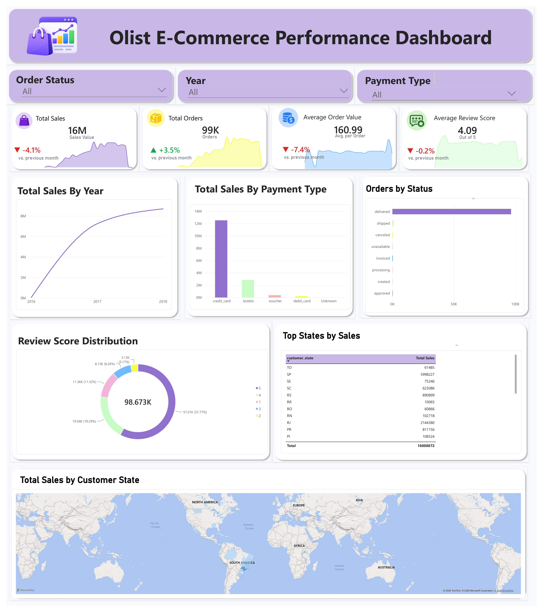

# Olist E-Commerce Power BI Dashboard

## Project Overview

Developed an interactive Power BI dashboard using the Olist e-commerce dataset to analyze sales performance, order activity, payment methods, customer reviews, order status, and geographic sales distribution.

The project involved data cleaning and preparation in Excel, building a relational data model in Power BI, and creating DAX measures for key performance indicators such as Total Sales, Total Orders, Average Order Value, and Average Review Score.

Interactive slicers were added to enable analysis by year, payment type, and order status. The final dashboard provides a clear overview of business performance and highlights key trends in customer behavior, sales growth, payment preferences, and regional performance.

## Dashboard Preview

